# 🛠️ Carrosserie – Montage et Fixation

## PRÉAMBULE

Faut être clair : ce projet va te prendre 100 heures facile. Impression, ponçage, ajustements, montage... Et tout ce temps, ton 4x4 restera à poil sur des cales, aussi mobile qu’un meuble IKEA pas monté.

C’est pas une bricole du dimanche, c’est un chantier. Si t’es pas prêt à y passer tes soirées, tes week-ends et à ruiner une chemise avec de la cyano, c’est maintenant qu’il faut faire demi-tour.

Matos minimum :
- Un kit de visserie 3 mm métrique (perso j’ai pris un mille-pièces, c’est pas pour frimer, c’est pour survivre).

- Des inserts filetés 3 mm, les vrais, ceux qui tiennent.

- D’un fer à souder de précision, pas ton vieux machin à griller les ESC.

- Et un joyeux bordel sur ton établi. Parce qu’un espace trop propre, c’est pas crédible. Et franchement, t’as déjà vu un maker qui bosse dans un bloc opératoire ?

- Du café. Beaucoup. En poudre, en grain, en perfusion si nécessaire. Sans ça, t’iras pas au bout. Si t’en arrives à infuser des copeaux de PLA pour rester éveillé, t’as été trop loin.

Et quand tu peindras ta caisse... libre à toi d’y mettre la couleur que tu veux. Tant que c’est couleur sable, bien sûr.

---

## Étape 1 – Les chandelles

[📦 STL des chandelles avant](https://github.com/Flo3376/traxxas_trx4_all_modif/raw/main/carrosserie/parts/jack_stands/jack_stands_F.stl)
[📦 STL des chandelles arrière](https://github.com/Flo3376/traxxas_trx4_all_modif/raw/main/carrosserie/parts/jack_stands/jack_stands_R.stl)

On va commencer par imprimer les chandelles:
- 0.8mm pour la buse
- Orientation : socle vers le bas, évidemment. Pas la peine de faire les malins avec des supports tordus dès le départ. Ça dérapera bien assez tout seul plus tard.
- Adhérence par jupe conseillée
- support oui

La chandelle avec le rond dans le socle c'est pour le train avain, celle avec le trou carré, tu devines pour quoi c’est....
Si tu bloques déjà ici... comment dire... Ça promet pour la suite. Vraiment.

## Étape 2 – Dépose des éléments en trop

Pas de quartier :

- Supports de carrosserie

- Supports de pare-choc

- Marchepieds

Tout ça, dehors. On vire tout ce qui dépasse. Ce qui reste doit être prêt à accueillir du neuf, du solide, du printé maison.

Les photos montrent une version équipée de la boîte 2 rapports et des commandes de blocage de ponts. Si t’as pas ça, pas grave. Mais sache que t’es déjà jaloux, un peu.

🛠️ Note sérieuse :
À ce stade, y’a aussi le support batterie qui pourrait bien y passer.
Je dis rien pour l’instant, mais j’ai une idée qui va peut-être émerger. Ou exploser. On verra. Mais ça sera une option 

💥 Concernant le câblage :
Ne paniquez pas si c’est un sac de nœuds. Si vous voyiez le câblage dans ma tête, vous relativiseriez tout de suite. Comme on dit chez nous :

> "Tous les étages sont câblés, mais pour le voltage, on repassera."

🔍 Remarque :
Il manque une pièce sur le train arrière, celle qui relie les suspensions. Elle n’est pas forcément à démonter, c’est juste que je l’ai perdue lors d’un road trip sans carrosserie. Si vous, vous l’avez encore, tant mieux. Sinon, bienvenue au club.

Et pendant qu’on y est : un petit nettoyage, ça mange pas de pain. C’est quand même plus agréable de bosser sur un engin propre.
(Et non, pas de blague douteuse sur "votre engin", merci. On a dit propre.)

## Étape 2 – La charnière de capot avant

[📦 STL de la charnière avant](https://github.com/Flo3376/traxxas_trx4_all_modif/raw/main/carrosserie/parts/hinge_hood_front_v3/hinge_hood_front_v3.stl)

- 0.8mm pour la buse
- À imprimer comme sur l’image.
Pourquoi ? Pour éviter que la pièce se fasse cisailler au premier face-à-face non consenti avec un obstacle. Ça semble con, mais tu seras content que ça tienne.
- support non

---

⚙️ Première pièce à installer.
Il vous fraudra :
- 6 inserts
- 4 vis en M3x10mm

---

⚠️ Précautions à prendre pour pas faire n’importe quoi dès le début :
- Afin de rentrer les inserts proprement et sans forcer comme un goret, il faut les chauffer quelques instants à température élevée.
Mon fer, lui, démarre à 300°C par défaut. C’est pas pour faire style, c’est parce que ça marche.

Et voici un dicton d’un grand sage – gravé par la douleure. À mémoriser absolument :
> Ta main tremblera, ton insert tombera.
 Le rattraper tu voudras.
 Ce réflexe à la con, tu auras.

- Serrage à la main, pas comme un bourrin avec une visseuse.
- Pas de rondelles : de toute façon ça passe pas.
- Pas de frein filet, inutile ici.
- Et la face plane vers l’avant, pas besoin de vous faire un dessin (enfin si, y’a les photos).

>la dépose des roues avant n'est pas obligatoire, mais ça peut être pratique

---

## Étape 3, 4, 5 et, ...et... et pis merde– Le capot, son support, la façade,...

[📦 STL du support capot](https://github.com/Flo3376/traxxas_trx4_all_modif/raw/main/carrosserie/parts/hood_mount_frame_v3/hood_mount_frame_v3.stl)
[📦 STL de face avant](https://github.com/Flo3376/traxxas_trx4_all_modif/raw/main/carrosserie/parts/body_front_face_v2/body_front_face_v2.stl)
[📦 STL du capot](https://github.com/Flo3376/traxxas_trx4_all_modif/raw/main/carrosserie/parts/hood/hood.stl)
[📦 STL support des angels eyes](https://github.com/Flo3376/traxxas_trx4_all_modif/raw/main/carrosserie/parts/angel/angel_v1.stl)

---
support de capot

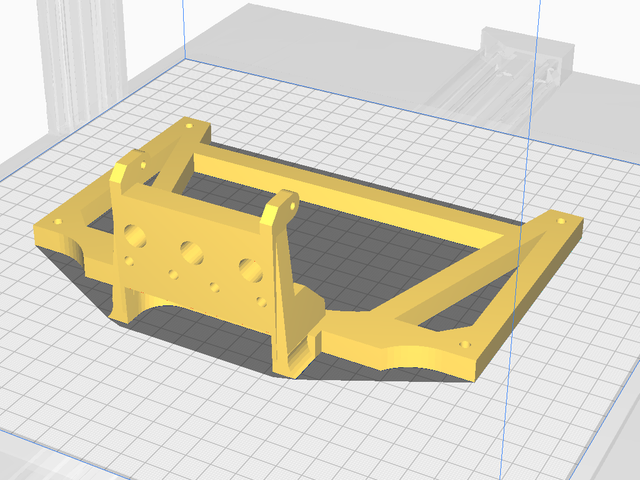
- 0.8mm pour la buse
- Sens d'impression selon votre choix de défaut.
  - Comme sur l’image : ça va wrapper, mais comme c’est caché, ça restera notre petit secret.
  - Debout (façade contre plateau) : vous allez cramer du filament pour des supports, et si votre machine a la tremblote à en sucrer les fraises, c’est foutu.
  - Sur le côté : mélange des deux emmerdes. À vous de voir.
  - support non

---
façade avant

- 0.8mm pour la buse
- À imprimer comme sur l’image, si vous n'avez pas de soucis d'adhérence au plateau.
- support oui

---
angel eyes (optionnel)

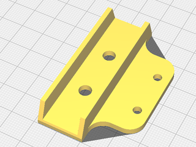
- 0.8mm pour la buse
- À imprimer comme sur l’image.
- support non

---
capot

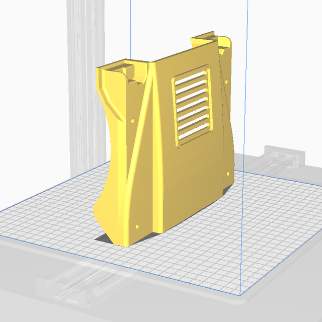
- 0.8mm pour la buse
- À imprimer comme sur l’image pour éviter que les couches se voit trop
- imprimante au ralentie, ça limitera les dégats de colision.
- Adhérence par jupe obligatoire / radeau conseillé pour les machines un peu plus capricieuse
- support oui

---
Bon la ça va commencer à donner le sourrire.
Une fois que vous avez nettoyer les pièces, il va vous falloir:
- 8 insert (ça commence à faire mais vous avez 10 doigts, vous vous en sortirer)
- 4 ou 2 vis M3 x 10mm pour fixer la façade (je ne vous ai pas dit de la monter bordel.) Si vous ne montez pas l'option Angel eye c'est 4, sinon remplacer les 2 vis du centre par des M3x20mm.
- 2 vis M3 x 15mm  et 2 M3 x 18mm+ rondelle pour fixer le capot (range cette putain de visseuse, je ne le dirai pas 2 fois)
- 2 vis M3 x 12mm + si vous avez une lichette de frein filet léger

🛠️ Étapes de montage
- Pose des 8 inserts sur le support capot :
  - 4 sur la façade
  - 1 sur chaque coin du support
  >4 + 4 = 8, on valide.

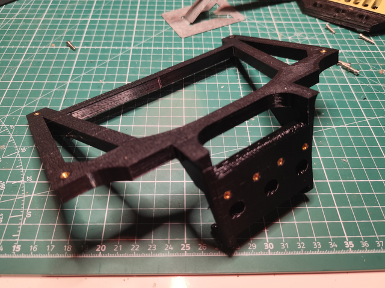

---

- Fixation de la façade :
  - Si vous utilisez les Angel Eyes :
    - Vissez les 2 vis externes
    - Glissez le support LED avec les deux LEDs déjà montées par le haut
      (si tu fais pas ça dans l’ordre, viens pas pleurer)
    - Puis serrez les 2 vis centrales
  - Sinon, 4 vis M3 x 10mm direct.

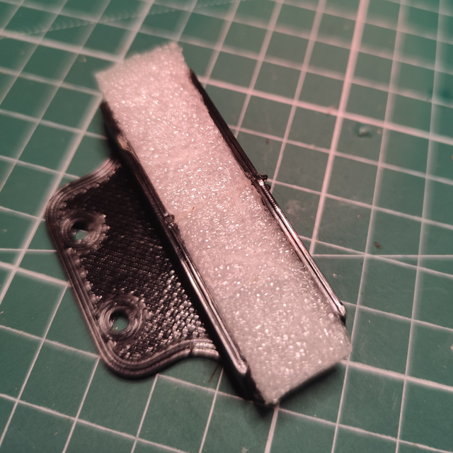
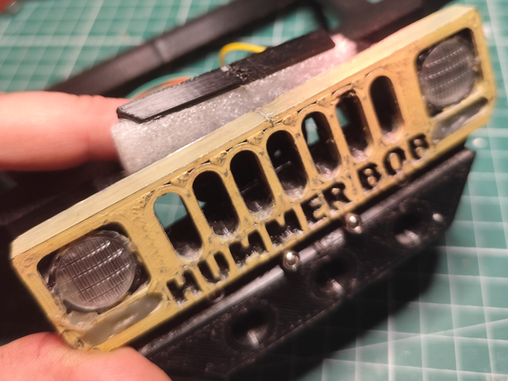
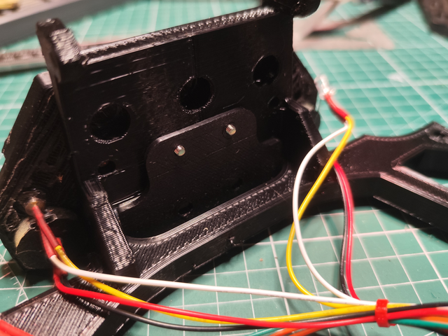
---

- Fixation du support capot sur la charnière :
  - Utilisez les 2 vis M3 x 12 mm
  - Pour le premier montage ne mettez de frein filet
    > vous devrez certaine le déposer pour faciliter la suite du montage) ,
  - Pour le montage définitif, mettez une micro goutte de frein filet 
    > (Pas un bain. Une goutte. Sérieux.)
  - Serrez, puis desserrez d’un tour.
    > Vous ne le faites pas ? Vous allez la voir passer, la douille, surtout avec le frein filet.

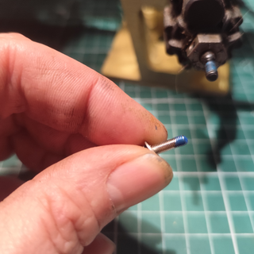
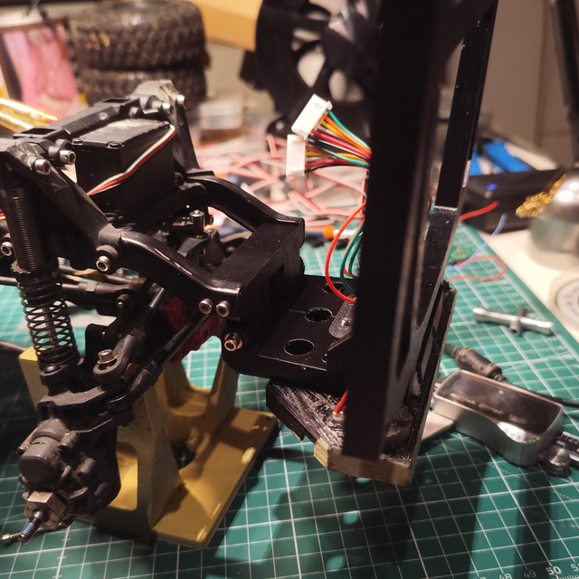
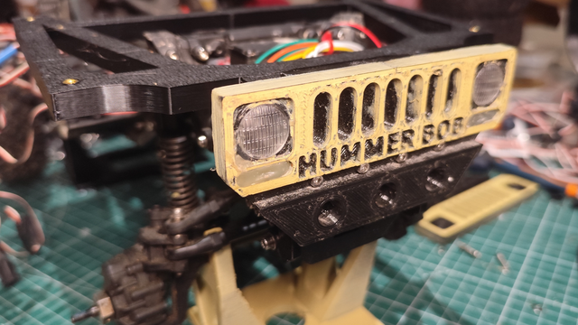

---

- Pose du capot :
  - Allez-y, posez le capot, mais ne serrez rien pour l’instant.
  - Mettez les 2 vis de 18 mm sur les zones les plus épaisses, les 2 plus courtes (15 mm) à l’avant, côté museau.
  - Il y aura des ajustements, donc on garde de la marge.
  - Astuce : ne pas serrer tout de suite facilite l’engagement dans les inserts sans les ruiner. Et ça évite de tout recommencer.

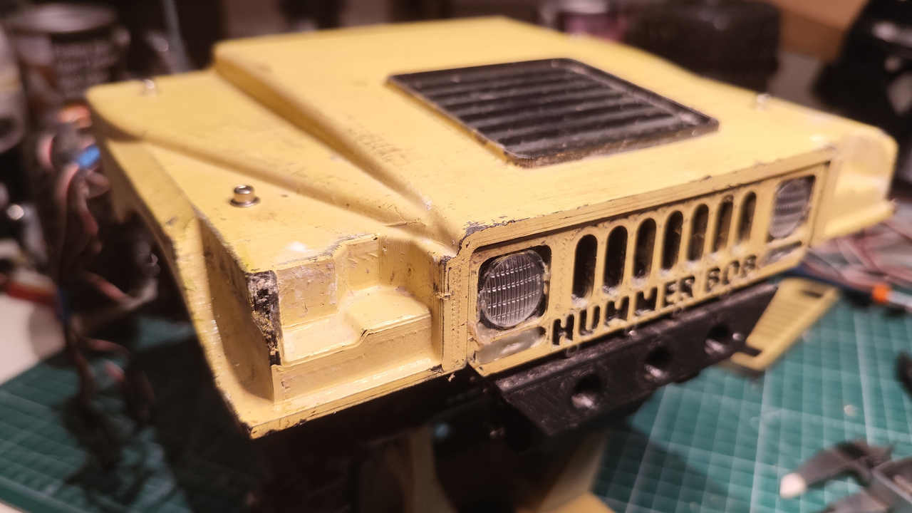

Et voilà. On marque une pause, on recule de deux pas, et on admire.
Prenez 5 minutes pour souffler... et pour siroter un café.
Vous l’avez mérité.

## Étape 7 (enfin je crois), Préparation du rigidifieur arrière et des supports:

[📦 STL du rigidifieurt](https://github.com/Flo3376/traxxas_trx4_all_modif/raw/main/carrosserie/parts/rear_chassis_brace/rear_chassis_brace.stl)

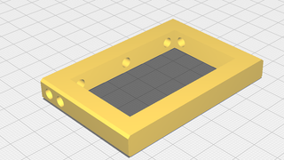
- 0.8mm pour la buse
- À imprimer comme sur l’image, aucun piéges.

🧱 Le rigidifieur (aka la traverse qui tient la baraque)
Avant tout, faut préparer le rigidifieur, cette pièce qu’on vient caler entre les deux longerons du châssis.

Il faut y poser 7 inserts. Pas 6. Pas 8. Sept.

Et prévoir 6 vis M3 x 10 mm avec rondelles pour la suite.

Si t’en rates un, tu vas t’en souvenir au moment de l’assemblage. Et ce sera trop tard. Donc on le fait bien maintenant, pendant que t’as encore les doigts intacts.

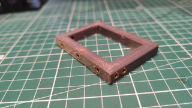

---
🔧 Le support droit/gauche (arrière)
[📦 STL du support droit et gauche](https://github.com/Flo3376/traxxas_trx4_all_modif/raw/main/carrosserie/parts/rear_mount_v2/rear_mount_right_v2.stl)

>Le support gauche → n’existe pas en STL, parce qu’on n’est pas là pour faire du copier-coller à la main.
>Il suffit de dupliquer le support droit dans Cura et d’activer la symétrie miroir sur l’axe X.

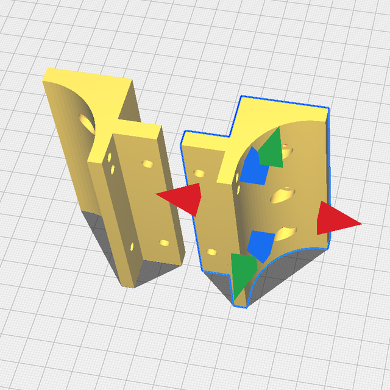
- 0.8mm pour la buse
- À debout et penser à dupliquer la piéces avec un symétrie en X.

