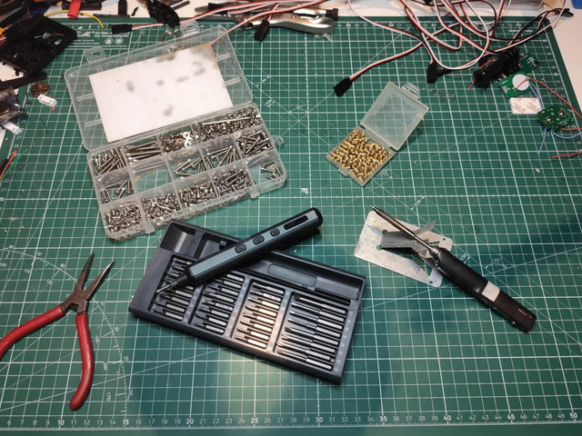

# 🛠️ Carrosserie – Montage et Fixation

## PRÉAMBULE

Faut être clair : ce projet va te prendre 100 heures facile. Impression, ponçage, ajustements, montage... Et tout ce temps, ton 4x4 restera à poil sur des cales, aussi mobile qu’un meuble IKEA pas monté.

C’est pas une bricole du dimanche, c’est un chantier. Si t’es pas prêt à y passer tes soirées, tes week-ends et à ruiner une chemise avec de la cyano, c’est maintenant qu’il faut faire demi-tour.

Matos minimum :
- Un kit de visserie 3 mm métrique (perso j’ai pris un mille-pièces, c’est pas pour frimer, c’est pour survivre).

- Des inserts filetés 3 mm, les vrais, ceux qui tiennent.

- D’un fer à souder de précision, pas ton vieux machin à griller les ESC.

- Et un joyeux bordel sur ton établi. Parce qu’un espace trop propre, c’est pas crédible. Et franchement, t’as déjà vu un maker qui bosse dans un bloc opératoire ?

- Du café. Beaucoup. En poudre, en grain, en perfusion si nécessaire. Sans ça, t’iras pas au bout. Si t’en arrives à infuser des copeaux de PLA pour rester éveillé, t’as été trop loin.

Et quand tu peindras ta caisse... libre à toi d’y mettre la couleur que tu veux. Tant que c’est couleur sable, bien sûr.

---

## Étape 1 – Les chandelles

[📦 STL des chandelles avant](https://github.com/Flo3376/traxxas_trx4_all_modif/raw/main/carrosserie/parts/jack_stands/jacks_stands_F.stl)
[📦 STL des chandelles arrière](https://github.com/Flo3376/traxxas_trx4_all_modif/raw/main/carrosserie/parts/jack_stands/jacks_stands_R.stl)

On va commencer par imprimer les chandelles:
- 0.8mm pour la buse
- Orientation : socle vers le bas, évidemment. Pas la peine de faire les malins avec des supports tordus dès le départ. Ça dérapera bien assez tout seul plus tard.

La chandelle avec le rond dans le socle c'est pour le train avain, celle avec le trou carré, tu devines pour quoi c’est....
Si tu bloques déjà ici... comment dire... Ça promet pour la suite. Vraiment.

## Étape 2 – Dépose des éléments en trop

Pas de quartier :

- Supports de carrosserie

- Supports de pare-choc

- Marchepieds

Tout ça, dehors. On vire tout ce qui dépasse. Ce qui reste doit être prêt à accueillir du neuf, du solide, du printé maison.

Les photos montrent une version équipée de la boîte 2 rapports et des commandes de blocage de ponts. Si t’as pas ça, pas grave. Mais sache que t’es déjà jaloux, un peu.

🛠️ Note sérieuse :
À ce stade, y’a aussi le support batterie qui pourrait bien y passer.
Je dis rien pour l’instant, mais j’ai une idée qui va peut-être émerger. Ou exploser. On verra. Mais ça sera une option 

💥 Concernant le câblage :
Ne paniquez pas si c’est un sac de nœuds. Si vous voyiez le câblage dans ma tête, vous relativiseriez tout de suite. Comme on dit chez nous :

> "Tous les étages sont câblés, mais pour le voltage, on repassera."

🔍 Remarque :
Il manque une pièce sur le train arrière, celle qui relie les suspensions. Elle n’est pas forcément à démonter, c’est juste que je l’ai perdue lors d’un road trip sans carrosserie. Si vous, vous l’avez encore, tant mieux. Sinon, bienvenue au club.

Et pendant qu’on y est : un petit nettoyage, ça mange pas de pain. C’est quand même plus agréable de bosser sur un engin propre.
(Et non, pas de blague douteuse sur "votre engin", merci. On a dit propre.)
